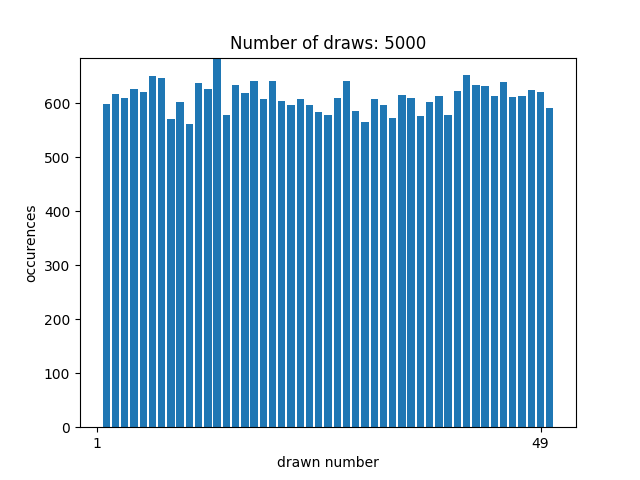
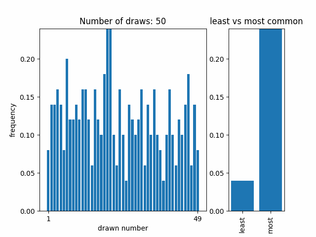
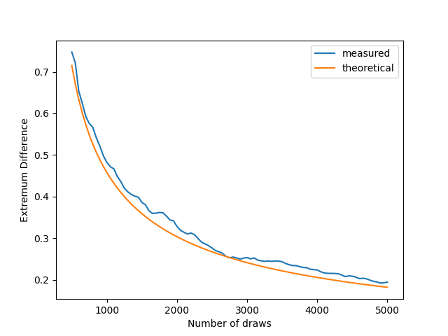

# Lotto Experiments

My family and I were discussing German Lotto statistics and we were baffled by the difference of occurences in the drawn numbers: The number 6 (most occuring) occured 624 times and the number 13 (least occuring) occured only 503 times in a total of ~5000 draws ([source](https://lotto.web.de/ratgeber/lottozahlen/meistgezogene-zahlen/) - it says 6000 but the maximum number of draws, assuming every number got drawn 624 times, is 5096). Fun Fact: 6 and 49 are the most occuring numbers (the Lotto variant is called "6 aus 49" which means as much as "choose 6 from 49") and the least occuring number is 13, a number commonly associated with bad luck in Germany.

That means the most occuring number occurs 24% more than the least occuring number. This baffled most of us, so i went on to simulate this process to see if this difference in occurences would also occur in my simulation.

## Plot Distribution

`plot_distribution.py` simulates 5000 draws and counts the occurences of each number.



## Animate Frequencies

`anim_frequencies.py` animates the frequencies of drawn numbers over time. It also compares the most occuring and least occuring numbers.



## Plot Extremum Difference

`plot_diff.py` plots how much more the most common number occurs than the least common number. This value is called *extremum difference* from now on. I also plotted a theoretical approximation of the difference.



### Theoretical Difference

The number of occurences of any given number can be seen as a binomial distribution: `p(x) ~ B(n, p)`, where `x` is number of occurences, `k` where `n` is the number of draws and `p` is the probability that the number occurs in a draw (6/49). This has a mean of `mu = n * p` and a variance of `sigma^2 = n * p * (1 - p)`.

To approximate the *extremum difference*, I used the mean shifted by 2.2 std deviations for the maximum and minimum number of occurences. The factor 2.2 was found by experimenting a bit. It is the parameter called `alpha` in the implementation and can be changed.

### Practical Difference

The practical *extremum difference* was calculated by simulating 20 Lotto runs of 6000 draws each and averaging their *extremum difference*.

## Minimum Number of Draws

`min_draws.py` finds the minimum number of draws needed for the theoretical *extremum difference* reach a given threshold. This is done in two ways:

- a kind of binary search on the natural numbers (did this first so I left it in)
- calculating the exact result (figured out how to do this after)

```text
Minimum number of draws achieving 24.06% (calculated):  3008.15
Minimum number of draws achieving 24.06% (found):       3009
Achieved Difference:    0.24056208056346318
Difference for 1 less:  0.2406068744681562
Difference for 1 more:  0.24051731077282135
```
